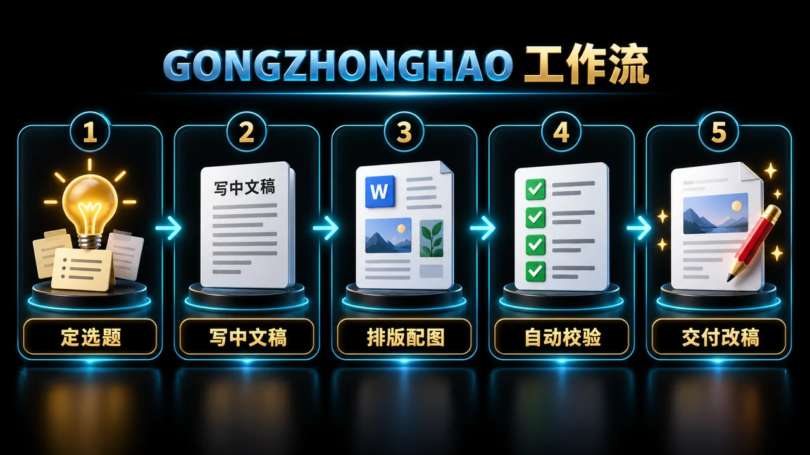

<!-- README-PROMO:START -->

  
  
  

<!-- README-PROMO:END -->

# GONGZHONGHAO — 公众号推文制作技能

从选题资料到中文成稿、DOCX 排版配图、自动校验和保图改稿的一体化公众号推文制作流程。

## 工作流

定选题 → 写中文稿 → DOCX 排版配图 → 自动校验 → 交付或保图改稿。

完整写作规范、排版参数与工具脚本见 [`SKILL.md`](SKILL.md)。

## 工具

- `scripts/make_docx.py`：生成排版文档
- `scripts/edit_docx.py`：保留图片与格式修改文字
- `scripts/validate_docx.py`：检查字数、图片、图注、字体和违禁词
